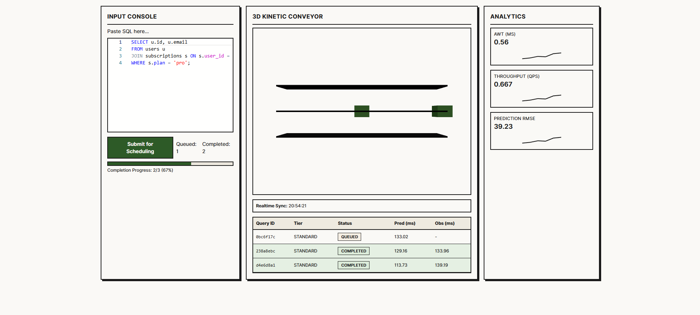
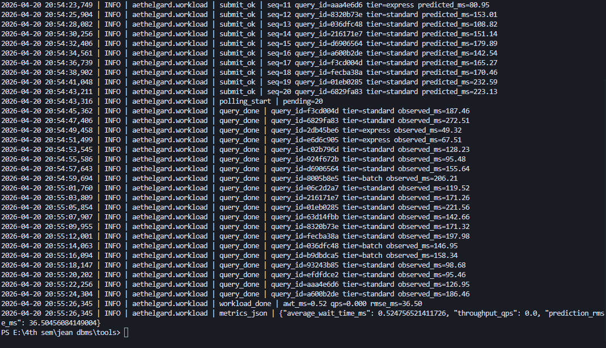
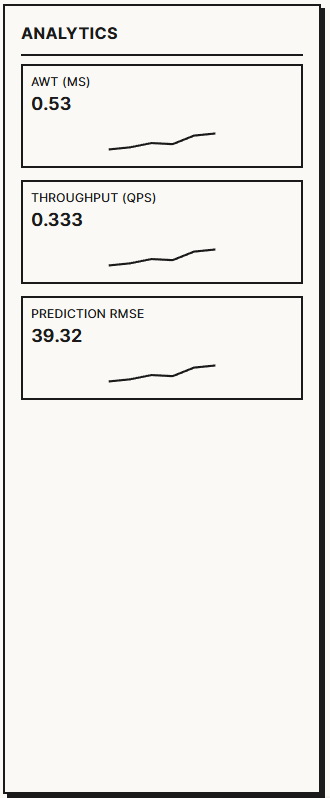

# Aethelgard: Predictive Query Scheduler

An interactive Predictive Multi-Level Feedback Queue (P-MLFQ) demo for SQL workloads.

- **Backend**: FastAPI + asyncio + scikit-learn RandomForestRegressor
- **Frontend**: React + TailwindCSS + GSAP + React Three Fiber
- **DB integration point**: PostgreSQL `EXPLAIN ANALYZE` hooks (stubbed client included)

---

## Quick Navigation

- [Live Demo Flow](#live-demo-flow)
- [Project Structure](#project-structure)
- [Quick Start](#quick-start)
- [Interactive API Guide](#interactive-api-guide)
- [Test Data and Load Testing](#test-data-and-load-testing)
- [UI + Backend Deep Dive](#ui--backend-deep-dive)

---

## Live Demo Flow

Use this section like a mini walkthrough while the app runs.

### Step 1: Start services

```bash
# Terminal 1
cd backend
python -m venv .venv
.venv\Scripts\activate
pip install -r requirements.txt
uvicorn app.main:app --reload --port 8000

# Terminal 2
cd frontend
npm install
npm run dev
```

Frontend calls backend at `http://localhost:8000`.

### Step 2: Submit queries from UI

- Use the query editor to submit different SQL styles.
- Watch lane assignment update live (`express`, `standard`, `batch`).
- Compare predicted vs observed runtime as jobs complete.

### Step 3: Validate metrics update

- Open analytics panel and track:
  - `AWT`
  - `QPS`
  - `RMSE`

<details>
<summary><strong>Interactive snapshots (click to expand)</strong></summary>

### 1) Full scheduler UI



### 2) Workload execution logs



### 3) Analytics focus view



</details>

---

## Project Structure

- `backend/` FastAPI scheduling + ML APIs
- `frontend/` React UI (Monaco, analytics panel, 3D lane visualization)
- `docs/` contracts and architecture notes
- `test-data/` SQL seed + sample query payloads
- `tools/` utility scripts for load simulation

---

## Quick Start

<details open>
<summary><strong>Backend</strong></summary>

```bash
cd backend
python -m venv .venv
.venv\Scripts\activate
pip install -r requirements.txt
uvicorn app.main:app --reload --port 8000
```

</details>

<details open>
<summary><strong>Frontend</strong></summary>

```bash
cd frontend
npm install
npm run dev
```

</details>

---

## Interactive API Guide

### 1) Submit Query

`POST /api/v1/query/submit`

- **Input**: SQL text
- **Output**: `query_id`, predicted runtime, tier (`express`, `standard`, `batch`)

### 2) Poll Priority

`GET /api/v1/query/{query_id}/priority`

- Returns current lane/priority for the query.

### 3) Fetch Metrics

`GET /api/v1/metrics`

- Returns throughput and scheduler quality metrics.

<details>
<summary><strong>Try it quickly with PowerShell</strong></summary>

```powershell
$body = @{ sql = "SELECT * FROM users LIMIT 10;" } | ConvertTo-Json
Invoke-RestMethod -Method Post -Uri "http://localhost:8000/api/v1/query/submit" -ContentType "application/json" -Body $body
Invoke-RestMethod -Method Get -Uri "http://localhost:8000/api/v1/metrics"
```

</details>

---

## Test Data and Load Testing

- Query samples: `test-data/sample_queries.json`
- Demo schema + data: `test-data/postgres_seed.sql`
- Synthetic workload runner: `tools/push_workload.py`

### Run sample load

```bash
python tools/push_workload.py
```

Expected behavior:

- Submits mixed workload from all tiers
- Polls queries until completion
- Prints final snapshot (`AWT`, `QPS`, `RMSE`)

### Optional: seed local PostgreSQL

```bash
psql -U <user> -d <db> -f test-data/postgres_seed.sql
```

---

## UI + Backend Deep Dive

- Data contract and field mapping: `docs/data-flow-and-contract.md`
- Full explanation of components + algorithm: `README.ui-backend.md`
- UI currently visualizes:
  - `status`
  - `tier`
  - `predicted_runtime_ms`
  - `observed_runtime_ms`

> `GroundTruthService` safely isolates `EXPLAIN ANALYZE` integration for production hardening and credentials management.
